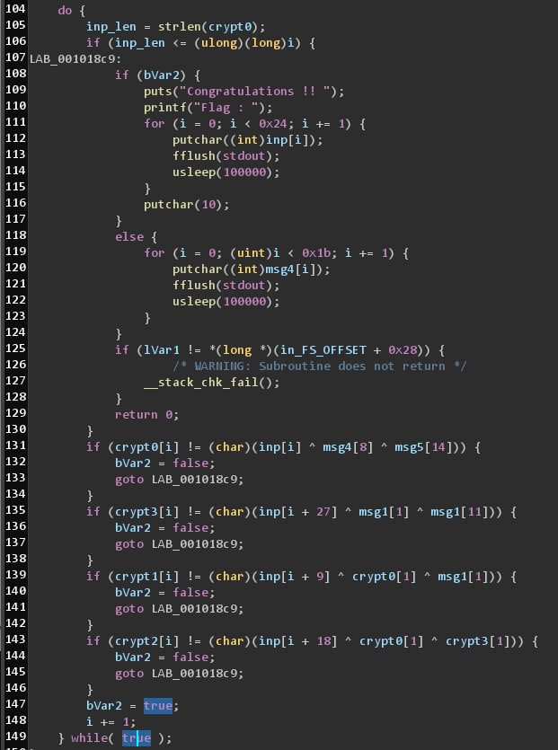

#### Simple task with difficult way to solve

A few conditions to check input <br>


I fully emulate elf binary(even \_\_libc\_start\_main) for this challenge.

Solve based on writeup from really cool guy: https://archercreat.github.io/securinets\_2020\_vm\_rev/
Solve engine is ttexplorer: https://github.com/JonathanSalwan/ttexplore

```
    ./build/Release/triton_krackme
    cat workspace/corpus/47 | xxd
    00000000: 4b43 5446 7b6b 5261 436b 5f4d 335f 6f4e  KCTF{kRaCk_M3_oN
    00000010: 655f 305f 664c 6147 5f63 3078 735f 6241  e_0_fLaG_c0xs_bA
    00000020: 7a61 727d ffff ffff 0000 0000 0000 0000  zar}............
    00000030: 0000
```
